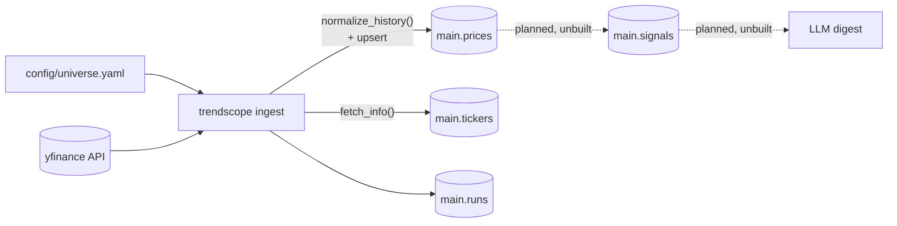
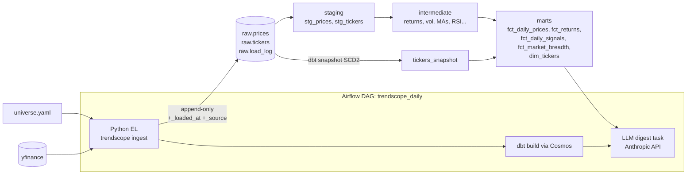

# TrendScope Migration Plan: dbt + Airflow Analytics Engineering Stack

Phase 0 recon output. Maps the current codebase to a target
ELT architecture — Python extract/load, dbt (dbt-duckdb) transforms,
Airflow 3 orchestration via Astro CLI + Cosmos. **No code changes in this
phase.** Open questions for approval are at the bottom.

---

## 1. Honest baseline — what exists vs. what the refactor spec assumes

The refactor brief describes "every transformation" and "the existing LLM
digest." Recon shows the repo is **Phase-1-complete only**. There is exactly
**one real transformation in the codebase** (ingest-time normalization);
signals and digest are docstring-only stubs:

| Area | Reality (verified 2026-07-14) |
|---|---|
| Ingestion (`src/trendscope/data/ingest.py`, 449 lines) | **Real.** yfinance → DuckDB upsert, retries, audit log, 32 passing tests |
| Signals (`src/trendscope/signals/*.py`, 8 modules) | **Stubs** — 1–2 lines each, no logic |
| Digest / LLM (`src/trendscope/digest/*.py`, 4 modules) | **Stubs** — no Anthropic import anywhere in `src/` |
| `signals` table | Exists, **0 rows** |
| `prices` table | 8,775 rows: 15 tickers, 2024-01-02 → 2026-05-01 |
| `tickers` table | 15 rows with sector/industry/groups/benchmark |
| `runs` audit table | 6 successful ingest runs |

**Consequence:** this migration is ~20% port (ingestion split into E/L,
normalization logic moved into staging models) and ~80% **net-new build**
(the entire signal library lands as dbt models for the first time; the
digest is built fresh in Phase 3). "Do not break the existing digest output
format" is vacuously satisfiable — there is no existing format; we define
it in Phase 3.

## 2. Current data flow



Everything below `prices`/`tickers` is aspiration, not code. Current
transformation inventory (the complete list):

| # | Current logic | Location | What it does |
|---|---|---|---|
| T1 | `normalize_history()` | `data/ingest.py` | Rename yfinance cols, flatten MultiIndex, `0.0`-split → `1.0`, drop NaN rows, index → `date` column, add `ticker` |
| T2 | Upsert semantics | `upsert_prices()` | `ON CONFLICT (date,ticker) DO UPDATE` — latest fetch wins |
| T3 | Ticker metadata enrich | `ensure_ticker_metadata()` | yfinance `.info` → name/sector/industry/asset_type; groups+benchmark refreshed from YAML every run |
| T4 | Run audit | `start_run()`/`finish_run()` | Row per ingest with status/rows/errors |

## 3. Target architecture



## 4. Transformation mapping — existing → target

| Current | Target | Layer | Notes |
|---|---|---|---|
| T1 rename/cast/flatten | `stg_prices` | staging (view) | Column renames + casts move to SQL. MultiIndex flattening **stays in Python** (pre-storage, pandas-shape concern) |
| T1 `0.0`-split → `1.0` | `stg_prices` | staging | `CASE WHEN split_ratio = 0 THEN 1.0 …` |
| T1 NaN-row drop | `stg_prices` | staging | `WHERE close IS NOT NULL AND …` — raw keeps everything; staging filters |
| T2 upsert / latest-wins | `stg_prices` dedup | staging | Raw becomes append-only; staging picks latest `_loaded_at` per `(date, ticker)` via `row_number()` |
| T3 metadata refresh | `raw.tickers` (append) + `tickers_snapshot` (SCD2) + `dim_tickers` | snapshot + mart | In-place `UPDATE` becomes snapshot history — strictly more information |
| T4 `runs` audit | `raw.load_log` (EL only) + Airflow task logs + dbt artifacts | — | See Q2 |
| `signals` table contract `(date, ticker, signal_name, value)` | `fct_daily_signals` | mart (incremental) | Same long-form shape, now built by dbt |

## 5. Net-new models (the unbuilt signal library, as SQL)

Parameters move from `settings.yaml` → `dbt_project.yml` vars.

| Planned Python module | Target model(s) | Layer | Signal logic |
|---|---|---|---|
| `signals/momentum.py` | `int_returns_multi_horizon` | int | 1/5/21/63/252-day returns + cross-sectional percentile ranks per date |
| `signals/trend.py` | `int_moving_averages` | int | 50/200 SMA, golden/death-cross flags. **ADX deferred — see Q4** |
| `signals/meanrev.py` | `int_rsi_zscore` | int | 20d price z-score; **Cutler's RSI** (SMA-based; Wilder's needs recursive smoothing — poor fit for window SQL, see Q4) |
| `signals/volatility.py` | `int_realized_volatility` | int | 20d realized vol; 252d trailing percentile via windowed list-aggregation |
| `signals/volume.py` | `int_volume_stats` | int | volume / 20d avg ratio, spike flag |
| `signals/relative.py` | `int_relative_strength` | int | ticker return − benchmark-ETF return (benchmark from `dim_tickers`) |
| `signals/breadth.py` | `fct_market_breadth` | mart | % of universe above 50MA, % positive 21d momentum, per date |
| `signals/compute.py` | `dbt build` | — | Orchestrator superseded entirely |
| `signals/fundamentals.py` | — | — | Was a placeholder; stays out of scope |

All intermediate models feed `fct_daily_signals` (long-form) and stay
individually queryable for the docs lineage graph.

## 6. dbt project shape

```
dbt/                          # dbt project root (repo subdir)
  dbt_project.yml             # vars: ma windows, rsi period, horizons…
  profiles.yml                # duckdb; path from env DUCKDB_PATH; targets dev/ci
  packages.yml                # dbt-utils
  seeds/
    sector_etf_map.csv        # ticker → benchmark (see Q6)
    raw_prices_sample.csv     # CI-only, +enabled only when target == 'ci'
    raw_tickers_sample.csv    # CI-only
  models/
    staging/    (views)       stg_prices, stg_tickers  + sources.yml w/ freshness
    intermediate/ (views)     int_* per table above
    marts/                    fct_daily_prices (incremental), fct_returns (incremental),
                              fct_daily_signals (incremental), fct_market_breadth,
                              dim_tickers (table)
  snapshots/  tickers_snapshot.sql   # check strategy on metadata cols
  tests/      no_negative_prices.sql, no_future_dated_rows.sql,
              trading_calendar_gaps.sql
```

- **Incremental correctness:** `unique_key=['date','ticker']` (+`signal_name`
  for signals), `is_incremental()` filter with a `var('lookback_days', 7)`
  reprocess window so late restatements heal on the next run.
- **Point-in-time:** every window frame is `ROWS BETWEEN n PRECEDING AND
  CURRENT ROW` — no future rows by construction; enforced by the
  `no_future_dated_rows` singular test and code review of frames.
- **Source freshness:** `raw.prices` `_loaded_at` — warn 24h / error 72h
  (72h so weekends don't page).

**Test inventory (target ≥ 25):** uniqueness of `(date,ticker[,signal_name])`
on stg_prices, fct_daily_prices, fct_returns, fct_daily_signals,
fct_market_breadth (5); not_null on key/critical cols (~7);
`relationships` ticker → dim_tickers on 3 marts (3); `accepted_values`
asset_type + signal_name (2); `accepted_range` volume ≥ 0, RSI 0–100,
percentiles 0–1 (3); seed uniqueness (1); 3 singular tests (3) ⇒ **24 generic
+ 3 singular = 27**, before column-level extras.

## 7. Extract/Load redesign (Phase 1)

- `raw.prices` / `raw.tickers`: **append-only**, plus `_loaded_at TIMESTAMP`
  and `_source VARCHAR`. No UPDATEs, ever.
- Idempotency: anti-join before insert — a re-run of the same day inserts
  only rows whose `(date, ticker, _source)` is absent **or whose values
  changed** (content-hash compare). Unchanged reruns are no-ops;
  restatements append a new version; staging dedups latest-wins. (Q1)
- Existing 8,775-row history: one-time
  `INSERT INTO raw.prices SELECT …, ingested_at AS _loaded_at, data_source AS _source FROM main.prices`
  — preserves original load timestamps. Legacy tables dropped only after
  parity check. (Q3)
- Python 3.11 → **3.12** (`.python-version`, `requires-python`, CI, uv.lock
  regenerated). 3.12 is inside both Airflow 3's and dbt-core's support
  windows. (Q8)
- Existing pytest suite: EL-side tests (normalize, retries, fetcher
  protocol) survive nearly unchanged; upsert tests become append/idempotency
  tests; schema tests re-point at `raw`.

## 8. Airflow (Phase 3)

- **Astro CLI** scaffold at repo root (`dags/`, `include/`, `Dockerfile`,
  `requirements.txt`); dbt + Cosmos + project deps pinned in the image;
  requirements generated from uv to keep one source of truth.
- DuckDB path via `TRENDSCOPE_DUCKDB_PATH` env — local default
  `data/trendscope.duckdb`; under Astro, a mounted `include/data/…` path.
  CLI (`make daily`) keeps working without Airflow.
- DAG `trendscope_daily`: `extract_load` → Cosmos `DbtTaskGroup` (each
  model/test = one task) → `llm_digest` → `publish_digest`.
  Schedule `0 18 * * 1-5` in `America/New_York`, `catchup=False`, 2 retries
  w/ exponential backoff, task timeouts, failure callback.
- **DuckDB is single-writer.** All write tasks share an Airflow pool
  (`duckdb`, 1 slot) so Cosmos-parallelized model tasks serialize instead of
  fighting over the file lock. This is the one place the "distributed
  orchestrator, embedded database" combo needs care; a pool is the boring fix.
- `extract_load` emits an Airflow **Asset** on `raw.prices` (cheap, enables
  future data-aware consumers); intra-DAG ordering stays plain task chaining.

## 9. Digest (Phase 3) — built fresh

`filters` logic becomes a mart query (interesting-ticker rules in SQL);
`news.py` (yfinance headlines) and `llm.py` (Anthropic `claude-sonnet-4-6`,
structured prompt from `fct_daily_signals` + headlines) are written new;
output contract defined then: markdown to `digests/YYYY-MM-DD.md` + stdout.
CI never calls yfinance or Anthropic (Phase 4 seeds + no digest task in CI).

## 10. Open questions — need your call before Phase 1

Each has a recommendation; "approve all recommendations" works as an answer.

- **Q1 — Raw restatement policy.** Append-only raw can't UPDATE when
  yfinance restates a bar. *Recommend:* content-aware append (new version
  row when values differ), staging latest-wins. Alternative: pure anti-join
  on keys (drops restatements silently).
- **Q2 — `runs` table fate.** Airflow logs + dbt artifacts now own
  transform observability. *Recommend:* keep a slim `raw.load_log` for the
  Python EL step only; retire the old `runs` table with the legacy schema.
- **Q3 — Legacy data.** *Recommend:* one-time SQL copy of the 8,775 rows
  into `raw` preserving `ingested_at`; drop `main.*` legacy tables after
  parity check. Alternative: re-pull everything from yfinance.
- **Q4 — Signal simplifications.** (a) **Cutler's RSI** (SMA variant,
  window-function-clean) instead of Wilder's recursive smoothing;
  (b) **defer ADX** from v1 (recursive smoothing, ugly in SQL, low marginal
  value next to MA-cross + momentum). *Recommend:* accept both; revisit ADX
  only if you miss it.
- **Q5 — Digest format.** Nothing exists to preserve. *Recommend:* define
  the contract in Phase 3 as `digests/YYYY-MM-DD.md` + stdout.
- **Q6 — `sector_etf_map` moves** from `universe.yaml` to a dbt seed
  (usable in SQL joins, versioned, shows up in lineage). `universe.yaml`
  keeps only the fetch lists (incl. `universe.local.yaml` overlay).
  *Recommend:* yes.
- **Q7 — Repo layout.** Astro scaffold at repo root, dbt project under
  `dbt/`, existing `src/trendscope` package retained for EL + digest.
  *Recommend:* yes.
- **Q8 — Python 3.12 bump.** Touches `.python-version`, `pyproject`, CI.
  Any reason to hold at 3.11? *Recommend:* bump.

## 11. Phase plan & verification

| Phase | Deliverable | Verify |
|---|---|---|
| 1 ELT split | `raw` schema, append-only EL, 3.12 + lockfile, migrated history | pytest green; rerun-same-day = 0 new rows; parity counts vs legacy |
| 2 dbt | project + layers + snapshot + sources + 25+ tests + docs | `dbt build` green; `dbt docs generate` full lineage; rerun-idempotence |
| 3 Airflow | Astro + Cosmos DAG + digest task | `airflow dags test trendscope_daily` end-to-end locally |
| 4 CI/polish | sqlfluff + seeded `dbt build` in Actions, pre-commit, README | CI green on PR; clean-clone quickstart < 15 min |
